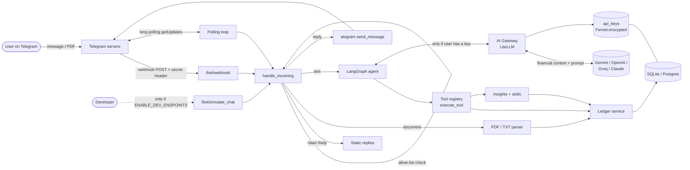
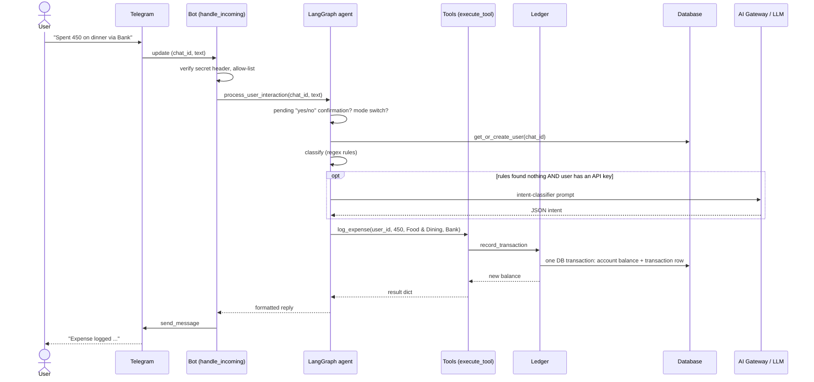
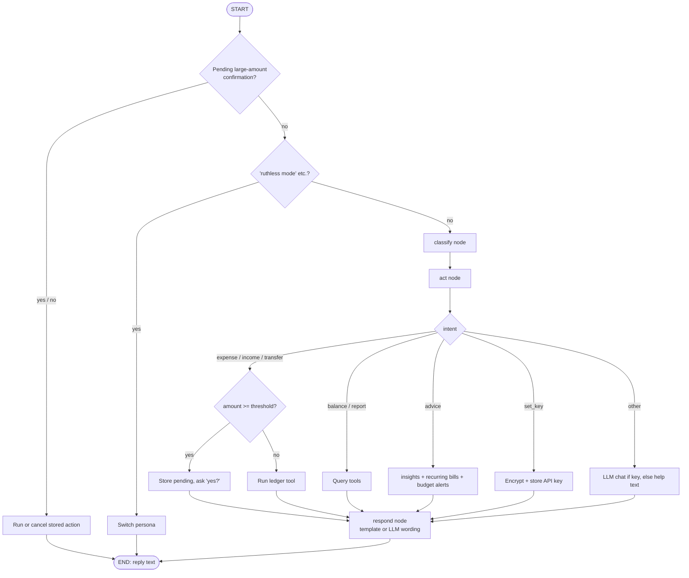
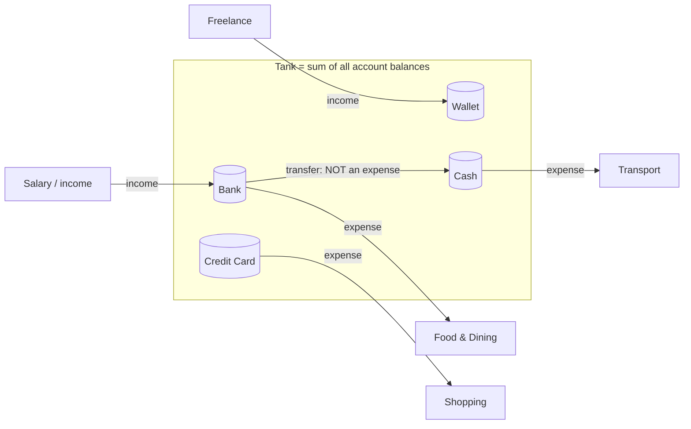
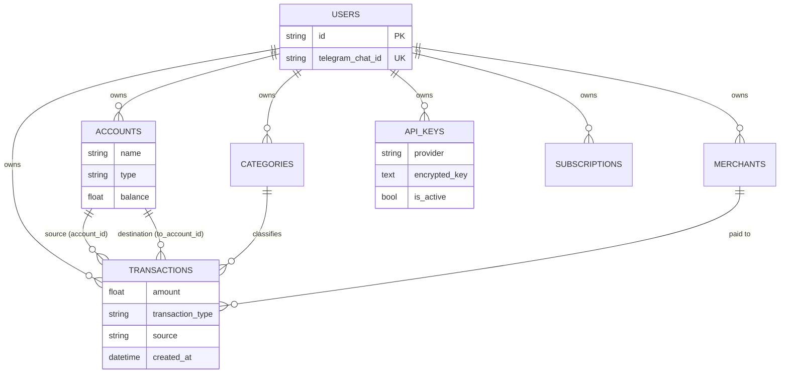
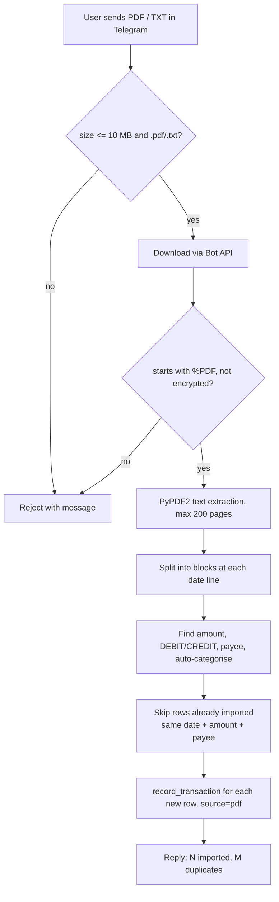
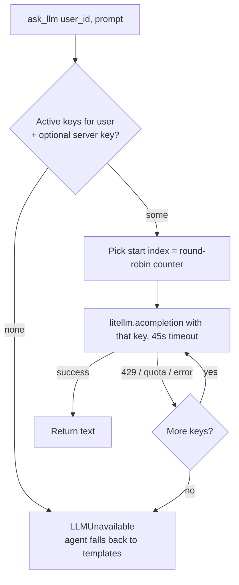

# WalletLedger Architecture

GitHub, VS Code and most Markdown viewers render the Mermaid blocks below.

## 1. System overview

## 2. One chat message, step by step

## 3. The agent graph (LangGraph)

## 4. Tank & Pipes money model

Expense: balance goes down, a category is charged. Income: balance goes up. Transfer: one account
down, another up, nothing is counted as spending.

## 5. Data model

## 6. PDF statement import

## 7. LLM key rotation and fallback

## 8. Deployment modes

